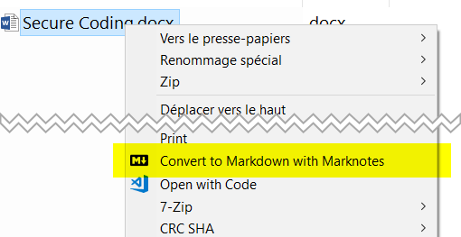

# .docx and .odt converter to Markdown


> Convert, in a batch mode, .docx and .odt files to markdown. Rely on [Pandoc](http://pandoc.org/).

This script is the ideal companion for [marknotes](https://github.com/cavo789/marknotes).

## Table of Contents

- [Description](#description)
- [Install](#install)
- [Usage](#usage)
- [License](#license)

## Description

This script is for Windows OS and will convert in batch every supported files (`.docx` and `.odt`) to the markdown language (`.md` files).

The utility will :

- convert any `.docx` and `.odt` files present in the folder and his subfolders,
- create one `.md` file by `.docx` or `.odt` file,
- will extract every images present in `.docx` or `.odt` and will save them in a `.images` folder (there will be one subfolder in `.images` by processed file),
- after the conversion, the original file will be moved in a `.files` folder

Note : the result `.md` will be as close as possible to the original but, please note, the conversion rely entirely on `Pandoc` and isn't made by this utility.

## Install

### Prerequisite

This utility rely on [Pandoc](http://pandoc.org/) and you need to first install it. Please refer to [http://pandoc.org/installing.html](http://pandoc.org/installing.html) for more information about the installation of Pandoc.

### Install the script

Put a copy of this script in the folder where you've the file to convert to markdown. Supported files are `.docx` and `.odt`.

Consider the following example :

```
C:\doc\
	file1.docx
    file1.odt
    subfolder\
		file2.docx
        file3.docx
```

If you want to convert, in only one run every files, save the `convert.vbs` script to the `C:\doc\` folder.

Then edit the script with a text editor like `Notepad`, `Notepad++`, `Atom`, ...

Search the line

```
Const cPandocExecutable = "C:\Christophe\Tools\pandoc\pandoc.exe"
```

You'll need to mention the path, on your system, to the `pandoc.exe` executable.

#### Add a 'Convert to Markdown with Marknotes' in the Windows contextual menu

What easier way than right-clicking and choosing `Convert to Markdown with Marknotes`?



To do this, edit the `marknotes_convert.reg` file with a text editor like Notepad. Search `C:\\Christophe\\Repository\\marknotes_convert` and replace that path with your's i.e. the location on your disk where you've saved the `marknotes_convert` repository.

Pay attention to the double `\`, you'll need to use the same syntax.

Below the actual content of the `.reg` file:

```
Windows Registry Editor Version 5.00

[HKEY_CLASSES_ROOT\*\shell\marknotes_convert]
@="Convert to Markdown with Marknotes"
"icon"="C:\\Christophe\\Repository\\marknotes_convert\\markdown.ico"
"AppliesTo"="System.FileName:\"*.doc\" OR System.FileName:\"*.docx\""

[HKEY_LOCAL_MACHINE\SOFTWARE\Classes\*\shell\marknotes_convert\command]
@="\"c:\\windows\\system32\\cscript.exe\" \"C:\\Christophe\\Repository\\marknotes_convert\\convert.vbs\" \"%1\""
```

Once edited, save the `.reg` file and double-click on it. Windows will ask if he need to merge that file with his registry and will warn about this action (can be risky). Let them to do the merge.

Note: to be able to modify the registry, you'll need to have enough permissions on your Windows system.

## Usage

Start a command prompt (`cmd.exe`), go to the folder where you've copy this script and run it by typing `cscript convert.vbs`.

## Contribute

PRs not accepted.

## License

[MIT](LICENSE)
